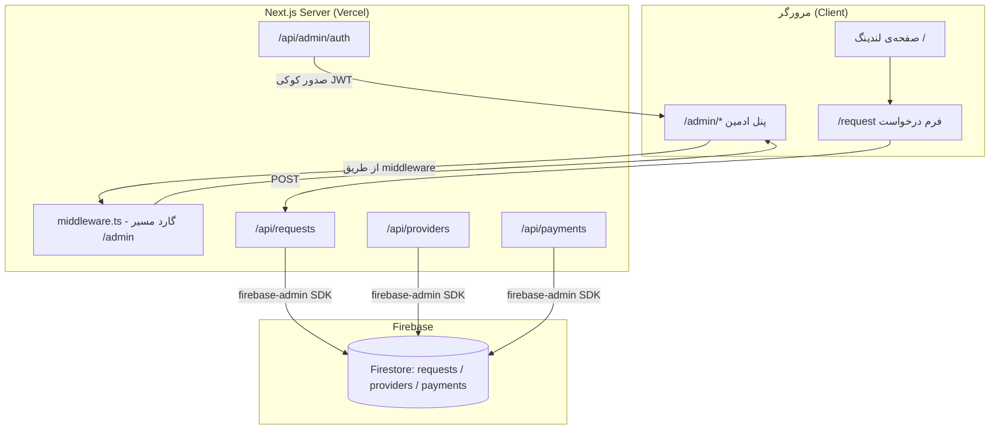
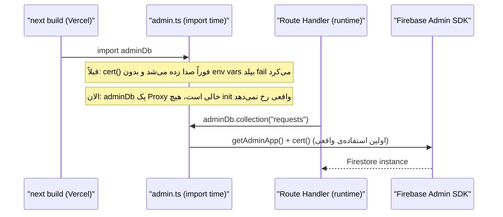
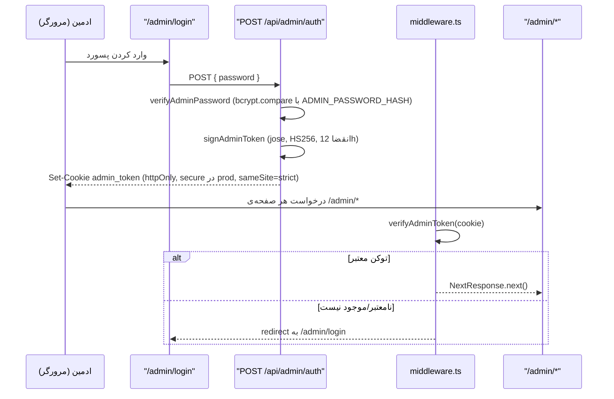
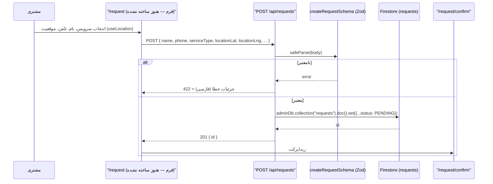
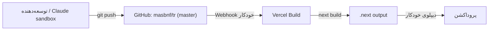

# معماری پروژه

## نمای کلی

مکانیکا یک اپلیکیشن **Next.js 14 App Router** تک‌ریپو (monolith) است که هم فرانت‌اند (صفحات مشتری + پنل ادمین) و هم بک‌اند (Route Handlerها) را در یک پروژه‌ی واحد نگه می‌دارد. پایگاه‌داده Firestore است و دیپلوی روی Vercel با اتصال مستقیم به گیت‌هاب انجام می‌شود.



## اصل کلیدی: جداسازی کامل Client SDK از Admin SDK

پروژه از **دو SDK جدا** برای Firebase استفاده می‌کند و این جداسازی عمدی و مهم است:

| | `src/lib/firebase/config.ts` | `src/lib/firebase/admin.ts` |
|---|---|---|
| پکیج | `firebase` (Client SDK) | `firebase-admin` |
| محیط اجرا | مرورگر (و هر جایی) | فقط سرور (Route Handlerها) |
| احراز هویت | کلید عمومی `NEXT_PUBLIC_FIREBASE_*` | Service Account (`FIREBASE_ADMIN_*`) |
| دسترسی به داده | محدود به Security Rules | دسترسی کامل (bypass Rules) |

در حال حاضر تمام خواندن/نوشتن واقعی داده (requests/providers/payments) از طریق **Admin SDK** در Route Handlerها انجام می‌شود — `db` از `config.ts` در حال حاضر جایی مصرف نمی‌شود، اما به‌عنوان زیرساخت برای فیچرهای real-time سمت کلاینت آینده نگه داشته شده.

### چرا Firestore Rules همه‌چیز را می‌بندد؟

`firestore.rules` طراحی شده تا با این معماری هم‌خوان باشد:

```
requests: create=true (مشتری مستقیم می‌تواند بسازد) ، read/update/delete=false
providers, payments: read/write=false
```

یعنی تنها راه خواندن/تغییر داده، عبور از Route Handlerهای سرور (که Admin SDK دارند و Rules را دور می‌زنند) است. این یعنی **کنترل دسترسی واقعی در Route Handlerها و میدل‌ور پیاده می‌شود، نه در Firestore Rules** — نکته‌ای مهم برای هر توسعه‌دهنده‌ای که یک endpoint جدید اضافه می‌کند: باید حواسش به auth check باشد چون Rules چیزی را متوقف نمی‌کند.

## الگوی Lazy-Init برای Firebase Admin



این الگو (کامیت `c35de6f`) یک تصمیم معماری مهم است: چون Next.js هنگام `next build` برای جمع‌آوری داده‌ی مسیرها ماژول‌ها را import می‌کند، هر کد سطح-ماژول که فوراً به env varهای اختیاری وابسته باشد، بیلد را می‌شکند. راه‌حل: `adminDb` یک `Proxy` است که init واقعی (`getAdminApp` → `getFirestore`) را تا اولین `.collection(...)` واقعی به تعویق می‌اندازد. **هر کد جدیدی که به سرویس بیرونی وابسته با env var اختیاری نیاز دارد، باید همین الگو را رعایت کند.**

## جریان احراز هویت ادمین



نکات امنیتی رعایت‌شده: کوکی `httpOnly` (غیرقابل خواندن با JS سمت کلاینت)، `sameSite: strict`، `secure` فقط در production. رمز JWT از `JWT_SECRET` خوانده می‌شود و یک fallback توسعه (`dev-secret-change-me`) دارد — **این fallback هرگز نباید در production واقعی استفاده شود**؛ اطمینان از تنظیم `JWT_SECRET` در Vercel الزامی است.

## جریان ثبت درخواست مشتری (Happy Path طراحی‌شده — UI هنوز ناقص)



Route Handler و اسکیمای Zod آماده و کامل‌اند؛ حلقه‌ی گمشده، خودِ کامپوننت فرم در `src/app/request/page.tsx` است (نگاه کن به [`MODULES.md`](./MODULES.md)).

## RTL و رندر فارسی

- `<html lang="fa" dir="rtl">` در `src/app/layout.tsx` — این جهت را برای کل درخت DOM تنظیم می‌کند؛ Tailwind از کلاس‌های logical-agnostic استفاده می‌کند (مثلاً `flex`, `gap`) که با RTL به‌طور طبیعی کار می‌کنند.
- فونت **Vazirmatn** به‌صورت **self-hosted** (نه Google Fonts CDN) با `next/font/local` بارگذاری می‌شود — این هم برای پرفورمنس (بدون درخواست شبکه‌ی خارجی) و هم برای استقلال از دسترسی به فونت‌های خارجی در build/runtime مهم است.
- اعداد فارسی (۰۱، ۰۲، ...) در جاهایی مثل `STEPS` در `page.tsx` به‌صورت hardcode رشته‌ای نوشته شده‌اند، نه با `toLocaleString("fa-IR")` — یک الگوی موجود که باید در کد جدید مشابه رعایت شود مگر تصمیم آگاهانه‌ای برای تغییر گرفته شود.

## دیپلوی



هیچ CI/CD جداگانه‌ای (GitHub Actions و...) در ریپو تعریف نشده؛ Vercel به‌تنهایی مسئول build و دیپلوی از برنچ `master` است. بنابراین **هر push به master مستقیماً پروداکشن را تحت تاثیر قرار می‌دهد** — لازم است `npm run build` و `npm run typecheck` قبل از push به‌صورت محلی اجرا شوند.
