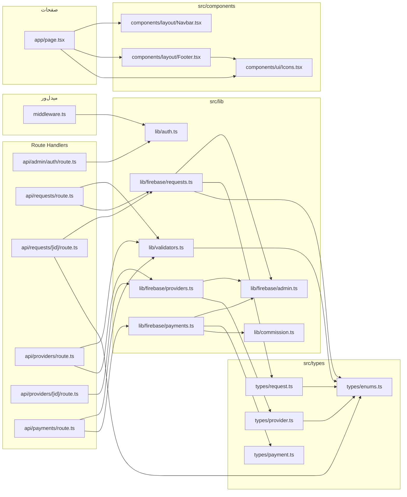
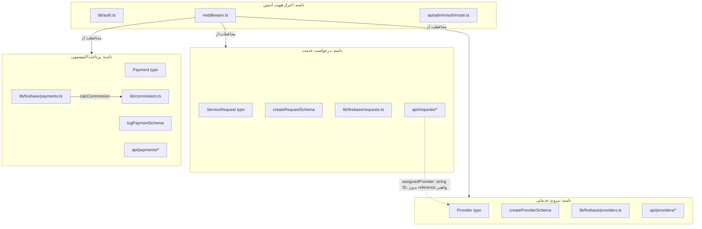

# نقشه‌ی دانش (Knowledge Graph)

این گراف از بررسی واقعی تمام importهای داخلی پروژه (`grep` روی `src/`) ساخته شده — هر یال یعنی «این فایل واقعاً آن فایل را import می‌کند»، نه یک رابطه‌ی فرضی.

## گراف کامل وابستگی‌ها



## نودهای «یتیم» (نوشته شده، هنوز مصرف نشده)

با بررسی کامل import graph، فایل‌های زیر توسط **هیچ** فایل دیگری import نمی‌شوند. (به‌روزرسانی ۲۰۲۶-۰۷-۱۲: `hooks/useLocation.ts` و `constants/services.ts` با `RequestForm.tsx` مصرف شدند؛ `constants/status.ts` با `OrdersTable.tsx` مصرف شد. `hooks/useAuth.ts` عمداً مصرف نشد — صفحات ادمین از `middleware.ts` برای گارد و از `fetch` مستقیم برای دیتا استفاده می‌کنند؛ `useAuth` یک لایه‌ی UI-only اضافه‌ست که فعلاً جایی لازمش ندارد.)

| فایل | برای چه چیزی آماده است |
|---|---|
| `hooks/useAuth.ts` | نمایش شرطی UI بر اساس وجود کوکی (مثلاً اگر بخوای بخشی از یک صفحه‌ی عمومی را بسته به لاگین بودن ادمین نشان/پنهان کنی) |
| `lib/maps.ts` | ساخت لینک نقشه در پنل ادمین (کاندید طبیعی: صفحه‌ی جزئیات سفارش `admin/orders/[id]`) |
| `lib/firebase/config.ts` (`db`) | فیچر real-time سمت کلاینت |

این‌ها **کد مرده نیستند** — زیرساخت از‌پیش‌آماده‌شده برای صفحات placeholder هستند (به [`ROADMAP.md`](./ROADMAP.md#اولویت-پایین--زیرساخت-آماده-ولی-بلااستفاده) مراجعه کن).

## خوشه‌های مفهومی (Domain Clusters)



**نکته‌ی مهم:** رابطه‌ی بین `ServiceRequest` و `Provider` (فیلد `assignedProvider`) یک **string ID ساده** است، نه یک reference واقعی Firestore یا foreign key با integrity check — یعنی هیچ‌جای کد تضمین نمی‌کند که یک `assignedProvider` واقعاً به یک سند موجود در `providers` اشاره کند. اگر نیازی به این تضمین بود، باید موقع پیاده‌سازی صفحه‌ی تخصیص نیرو در پنل ادمین اضافه شود.

## چطور این گراف را به‌روز نگه داریم

هر بار که یک import جدید بین فایل‌ها اضافه/حذف شد (به‌خصوص وقتی صفحات placeholder پیاده‌سازی می‌شوند)، این دستور را دوباره اجرا کن و گراف را sync کن:

```bash
grep -rn "from \"@/\|from \"\./\|from \"\.\./" src --include=*.ts --include=*.tsx
```
